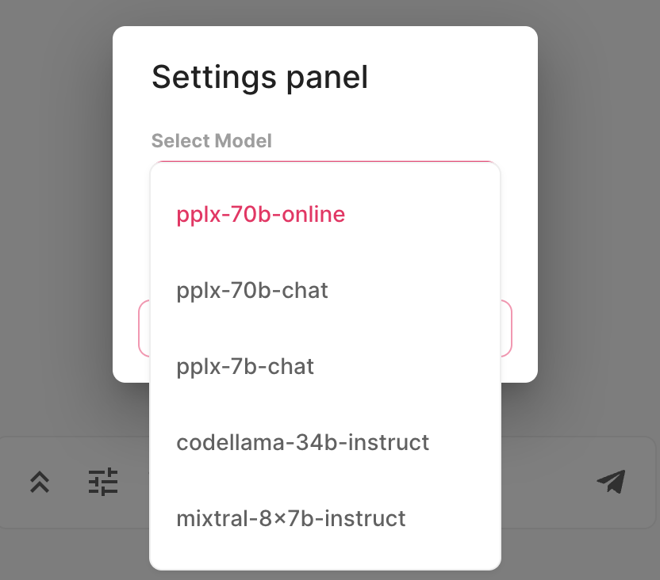
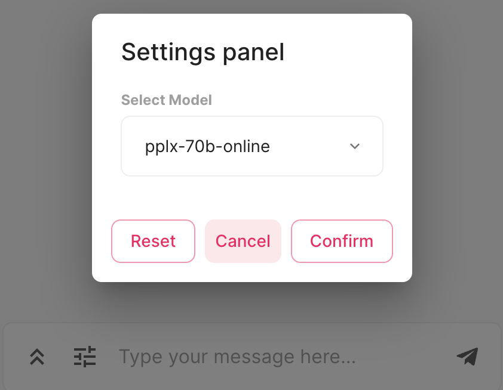

# perplexed
[](https://ko-fi.com/coolhand)
luke@assisted.space • [website](https://lukesteuber.com)

## Welcome to **perplexed**! 
This is a [Chainlit](https://chainlit.io/) implementation of the [Perplexity AI](https://www.perplexity.ai/) API.

### Setup and Installation

Clone the repository and install the requirements to get started with the chatbot:

```bash
git clone https://github.com/lukeslp/chainlit-perplexity
cd perplexed
pip install -r requirements.txt

```

Before running the chatbot, create a .env file based on .env.example and populate it with your Perplexity API key:

```
PERPLEXITY_API_KEY=your_api_key_here
```

Then launch the app with Chainlit:

```
chainlit main.py -w
```

### Getting Started

To use this chatbot, ensure you have the Chainlit library installed and set up your API key and endpoint in the code. Start the chatbot by running the `main.py` file, which will initialize the chatbot and load the necessary settings.

### Usage

- **Model Selection**: Choose from a variety of models including `pplx-70b-online`, `pplx-70b-chat`, `pplx-7b-chat`, `codellama-34b-instruct`, and `mixtral-8x7b-instruct` to tailor the chatbot's responses to your needs.
- **Changing the Model**: You can change the model by interacting with the settings panel. Simply click on the settings icon and select your desired model from the dropdown menu.
- **Sending Messages**: Type your message in the chatbox and hit send. The chatbot will respond using the selected model.
- **Loader Indicator**: When the chatbot is thinking or processing a request, a loader will appear to indicate that it is busy.

### Suggested Queries

Feel free to ask the chatbot anything from general knowledge questions to specific inquiries about programming, data analysis, and more. Here are some suggestions to get you started:

- "What is the tallest mountain in the world?"
- "How do I write a for-loop in Python?"
- "Explain the concept of machine learning."
- "What's the latest news from the front line in Ukraine?"
- "Estimate how many camels have ever fallen off a boat."

### Images

Below are images showing how to change the model using the settings panel:



_Settings panel with model options displayed._



_Settings panel with the option to confirm the selected model._

**Enjoy your conversation with perplexed!**

luke@assisted.space • [website](https://lukesteuber.com)
